# Being greedy and dynamic

This tutorial is telling about algorithms that
could be used for solving
programming problems using Dynamic Programming and Greedy Algorithm concepts. In the beginning it would be good to 
introduce definitions of some new therms,
which will be used during this tutorial.

## Optimal Substructure
### Definition
In the case of computer science, a problem is said to
have an optimal substructure, if and optimal solution
can be constructed from optimal solution of its sub-problems.

For the problems which have an optimal substructure,
greedy algorithm is usually used.
Otherwise, the dynamic programming is
used with the biggest frequency.

## Greedy Algorithm
### Definition
Greedy algorithm is 
basically the algorithm that is 
making the optimal choice at each stage.

### Examples
It could be used in solving the following problem:

`Calculate the smallest amount of 
banknotes used for representing N$`

The algorithm is: the program takes as many banknotes
of the biggest value that it could take 
and then goes to the next step, 
decreasing banknote value. In the end, the minimum 
amount would be achieved.

### Cases of failure
However, greedy algorithm fails to produce optimal solution for many other problems. 

For example, finding the largest path in weighted binary tree

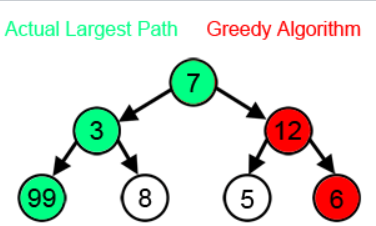

According to the greedy algorithm, 
the program is making the optimal choice every step,
but that is not optimal from a long-time perspective.

When choosing between 3 and 12, 
12 is optimal from a short-term perspective,
but not from a long-term one, 
because there is number 99 in the second level of the tree,
which makes path 7-3-99 the largest one.

## Dynamic Programming (DP)
### Definition
The dynamic programming is an algorithmic
technique for solving an optimization problem 
by breaking it into simpler sub-problems 
and ignoring the fact that the optimal 
solution to the problem depends on the 
optimal solution to its sub-problems.
### Explanation
The explanation will be done by 
showing the flow of solving a simple problem using DP.
The simple problem, which could be solved with DP is 
finding the Nth Fibonacci number.

If we need to calculate the Nth Fibonacci number,
we will derive it from the following equation:
```text
F(n) = F(n-1) + F(n-2)
```
As we can clearly see here, 
to solve the whole problem(that is F(n)), 
we broke it down into to smaller sub-problems
(which are F(n-1) and F(n-2)). 
This shows that we can use DP to solve this problem.

As we know, sub problems 
are the smaller versions of the original one. 
Any problem has overlapping sub-problems 
if finding its solution involves 
solving the same sub-problem multiple times.

For example, if we need to calculate F(4), 
we will have the following recursion tree:

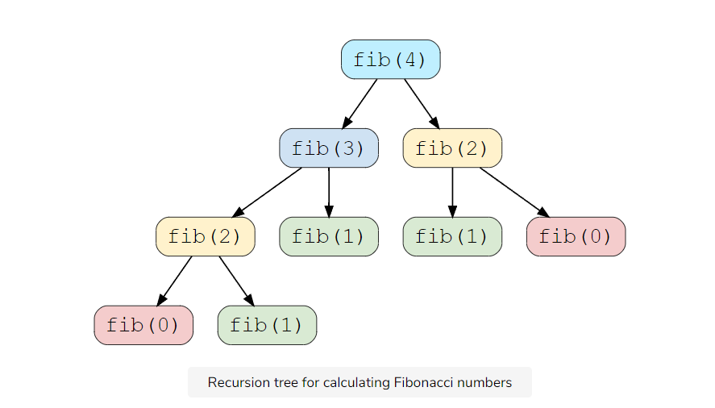

We can clearly see here the
overlapping sub-problem pattern, as
we calculate F(2) 2 times, F(1) 3 times and F(0) 2 times.

In addition, this problem has optimal substructure, 
because the solution of the whole problem 
could be made out of the solutions to its 
sub-problems.

DP gives us to possible methods to solve this problem. 
#### Top-down with Memoization
In computing, memoization is an optimization technique 
used primarily to speed up computer programs 
by storing the results of expensive 
function calls and returning the 
cached result when the same inputs occur again.

In this approach, we are solving the big problem
by solving the sub-problems and memorizing the result 
in the array. When we call our sub-problem again,
we, firstly, check whether it was solved, and only then, 
if it wasn't, solves it.

###### C++ code:
See Cpp/Fibonacci/memoization folder
```c++
//
// Created by glebg on 26.11.2021.
//
#include <iostream>
#include <vector>

class Fibonacci{
public:
    virtual int calculate_fibonacci(int n){
        std::vector<int> memoize(n + 1, -1);
        return recursion_fibonacci(memoize, n);
    }
    virtual int recursion_fibonacci(std::vector<int>& memoize, int n){
        if (n < 2){
            return n;
        }
        // if we have already solved this problem, 
        // return the result from the cache
        if (memoize[n] != -1){
            return memoize[n];
        }
        // if we haven't solved it yet,
        // solve and store the result
        memoize[n] = recursion_fibonacci(memoize, n - 1) + recursion_fibonacci(memoize, n - 2);
        return memoize[n];
    }
    virtual ~Fibonacci() = default;
};


int main(){
    Fibonacci* fibonacci{new Fibonacci};
    std::cout << "6th Fibonacci number is: " << fibonacci->calculate_fibonacci(6) << std::endl;
    std::cout << "7th Fibonacci number is: " << fibonacci->calculate_fibonacci(7) << std::endl;
    std::cout << "8th Fibonacci number is: " << fibonacci->calculate_fibonacci(8) << std::endl;
}
```
###### Output
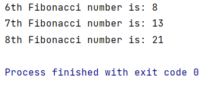

#### Bottom-up with Tabulation
This approach is kind of the opposite to Top-down Memoization,
because this method avoids recursion and solves the problem
by solving all the related sub-problems first and filling the 
N-dimensional table with the values. 
Only after filling up the table, 
the solution of the problem is calculated.
###### C++ code:
See Cpp/Fibonacci/tabulation folder
```c++
//
// Created by glebg on 16.11.2021.
//
#include <iostream>
#include <vector>
class Fibonacci{
public:
    virtual int calculate_fibonacci(int n){
        if (n==0){
            return 0;
        }
        // creating 1-dimensional table
        std::vector<int> tab(n + 1, -1);
        // solving the easiest sub-problems, needed for calculation
        // of the following ones
        tab[0] = 0;
        tab[1] = 1;
        //solving the other sub-problems and the main problem as well
        for (int i = 2; i <= n; ++i){
            tab[i] = tab[i - 1] + tab[i - 2];
        }
        return tab[n];
    }
    virtual ~Fibonacci() = default;
};

int main(){
    Fibonacci* fibonacci{new Fibonacci};
    std::cout << "7th Fibonacci number is: " << fibonacci->calculate_fibonacci(7) << std::endl;
    std::cout << "8th Fibonacci number is: " << fibonacci->calculate_fibonacci(8) << std::endl;
    std::cout << "9th Fibonacci number is: " << fibonacci->calculate_fibonacci(9) << std::endl;
    return 0;
}
```
###### Output
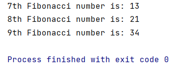
## Turtle path problem
#### Description
There is a NxM table with a certain amount of radiation 
at every tile of it. There is a turtle at the left top corner. It can go only to the right or to the left. 
```text
What is the smallest amount of radiation that turtle 
must go through to reach the right bottom corner?
```
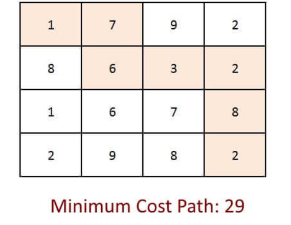
#### General idea
The idea of using dynamic programming in here is that we have 
a sub-problem to find the smallest path to a tile, 
when we have passed all the previous tiles,
in our case it is previous on the left and previous on the top.
This sub-problem has obvious solution. 
We just need to take the smallest value out of the previous left 
and the previous top and add the value at the tile as well.

When we know how to solve this sub-problem, we can make 
a table NxM with the minimal values for each tile. 
And our solution will be at the right bottom corner([N][M]).
#### Solution
###### C++ code:
See Cpp/Turtle_path folder
```c++
//
// Created by glebg on 28.11.2021.
//
#include <iostream>


int min_path(int** matrix, int rows, int columns){
    // initializing 2 dimensional array for calculating the path
    int ** table = new int* [rows + 1];
    for (int i = 0; i <= rows; ++i){
        table[i] = new int [columns + 1];
    }

    // filling first row and zero column with the minimal path
    // this path is the path from [1][1]
    table[1][1] = matrix[1][1];
    for (int i = 2; i <= columns; ++i){
        table[1][i] = table[1][i - 1] + matrix[1][i];
    }
    for (int i = 2; i <= rows; ++i){
        table[i][1] = table[i - 1][1] + matrix[i][1];
    }

    // performing dp algorithm for calculating the path with the smallest value
    for (int i = 2; i <= rows; ++i){
        for (int j = 2; j <= columns; ++j){
            table[i][j] = matrix[i][j] + std::min(table[i - 1][j], table[i][j - 1]);
        }
    }
    return table[rows][columns];
}


int main(){
    int rows{};
    int columns{};
    std::cin >> rows >> columns;
    int ** matrix = new int* [rows + 1];
    for (int i = 0; i <= rows; ++i){
        matrix[i] = new int[columns + 1];
    }
    for (int i = 1; i <= rows; ++i){
        for (int j = 1; j <= columns; ++j){
            std::cin >> matrix[i][j];
        }
    }
    std::cout << "The smallest value, that could be achieved is " << min_path(matrix, rows, columns) << "\n";
    return 0;
}
```
###### Output:
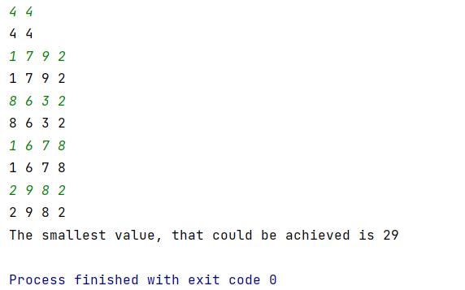
### The longest common sub-sequence
#### Description
The longest common subsequence (LCS) is 
defined as the longest subsequence that is 
common to all the given sequences, 
provided that the elements of the subsequence 
are not required to occupy consecutive positions 
within the original sequences.
#### Idea of the solution
We have sequences X{x1, x2, ..., xn} and Y{y1, y2, ..., ym}.
They have the longest common sub-sequence X{z1, z2, ..., zk}.

Next I will provide and prove 3 statements:
1. If xn = ym, then zk = xn = ym and 
{z1, z2, ..., z(k-1)} = LCS({x1, x2, ..., x(n-1)}, 
{y1, y2, ..., y(m-1)})
2. If xn != ym, then zk != xn, therefore
Z = LCS({x1, x2, ..., x(n - 1)}, Y)
3. If xn != ym, then zk != ym, therefore
z = LCS(X, {y1, y2, ..., ym})

The proving:
1. If zk != xn would be true, then it would be 
possible to add xn = ym to Z. Therefore, 
this new subsequence will have k+1 element, 
which contradicts the statement that Z is our LCS.
That actually proves that zk = xn = ym.
2. If xn != ym, Z is the LCS ({x1, x2, ..., x(n-1)}, Y). 
Assuming that {x1, x2, ..., x(n-1)} and Y have a sub-sequence W,
which length is more than k. Then, W is also a common 
sub-sequence of Z, but that contradicts the statement 
that Z is out LCS. That proves that LCS(X, Y) is the 
same as LCS({x1, x2, ..., x(n-1)}, Y).
3. Analogical to the second one.

The dynamic programming algorithm:
the tabulation method of DP will be used as 
in the "turtle path problem".
From the proven statements, 
if we have all the table before filled,
then we have 2 options:
1. if x[i] = y[j], then z[i][j] = z[i-1][j-1] + 1
2. if x[i] != y[j], then z[i][j] = max(z[i-1][j], z[i][j-1])

And our final solution of the problem is the value of z[n][m].
#### Solution
###### C++ code:
See Cpp/Longest_common_subsequence folder
```c++
//
// Created by glebg on 25.11.2021.
//
#include <iostream>
#include <sstream>
std::pair<std::string, int> lcs(const std::string& x, const std::string& y){
    // initializing the 2-dimensional matrix for the tabulation method
    // initializing the 2-dimensional array for the previous
    int ** z = new int*[x.length() + 1];
    auto ** prev = new std::pair<size_t, size_t>*[x.length() + 1];
    for (size_t i = 0; i <= x.length(); ++i){
        z[i] = new int[y.length() + 1];
        prev[i] = new std::pair<size_t, size_t>[y.length() + 1];
    }

// this part loops through the whole matrix and fills it
// loop for every row
    for (size_t i = 0; i <= x.length(); ++i){
        // loop for every column
        for (size_t j = 0; j <= y.length(); ++j){
            // if i and j are 0
            if (i == 0 || j == 0){
                z[i][j] = 0;

            // else if the element with index i in string x equals to the element with index j in string y
            } else if (x[i - 1] == y[j - 1]){
                // incrementing the lcs
                z[i][j] = z[i - 1][j - 1] + 1;
                // putting the previous indexes in the matrix of previous values, to be able to find the elements in lcs
                prev[i][j] = std::pair<size_t, size_t>{i - 1, j - 1};
            } else {
                // if the lcs for x[0:i] and y[j + 1] > lcs for x[0:i + 1][0:j]
                if (z[i - 1][j] > z[i][j - 1]){
                    // putting the value of the previous tile in the current one
                    z[i][j] = z[i - 1][j];
                    // putting the previous indexes in the matrix of previous values, to be able to find the elements in lcs
                    prev[i][j] = std::pair<size_t, size_t>{i - 1, j};
                } else {
                    // putting the value of the previous tile in the current one
                    z[i][j] = z[i][j - 1];
                    // putting the previous indexes in the matrix of previous values, to be able to find the elements in lcs
                    prev[i][j] = std::pair<size_t, size_t>{i, j - 1};
                }
            }   
        }
    }
    // part for finding the elements in lcs
    std::ostringstream str_cs;
    size_t i = x.length();
    size_t j = y.length();
    // moving backwards from [n][m] till the row or column is not 0
    while (i != 0 && j != 0){
        auto indexes = prev[i][j];
        // if there was an equality of the elements of x and y
        if (indexes.first == i - 1 && indexes.second == j - 1){
            // adding the element in front of the previous lcs
            std::string new_sub_sequence = x[i - 1] + str_cs.str();
            str_cs = {};
            // putting the new lcs inside the element of ostringstream type
            str_cs << new_sub_sequence;
        }
        // updating the indexes
        i = indexes.first;
        j = indexes.second;
    }
    // returning a pair with the elements that are in the lcs and the length of lcs
    return {str_cs.str(), z[x.length()][y.length()]};
}

int main(){
    std::string str1;
    std::string str2;
    std::cin >> str1;
    std::cin >> str2;
    auto _lcs = lcs(str1, str2);
    std::cout << "The length of the LCS is " << _lcs.second << "\n";
    // if the length of the lcs is not 0, then output lcs
    if (_lcs.second > 0){
        std::cout << "The LCS is: " << _lcs.first;
    }
    return 0;
}
```
###### Output:
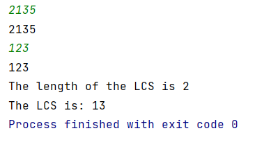
### Cutting the rod
#### Description
#### Solution idea
#### Solution
###### C++ code:
See Cpp/Cutting_rod folder
```c++
//
// Created by glebg on 03.12.2021.
//
#include <iostream>
#include <vector>

int rod(std::vector<int>& length, std::vector<int>& price, size_t total_length){
    std::vector<int> max_price{};
    // loops through all the lengths from 0 to total_length
    for (size_t i = 0; i <= total_length; ++i){
        // if i is less than the size of the array of lengths(it is assumed that weight[i] == i)
        if (i < price.size()){
            // putting the default value in the end of the max_length value
            // it is needed in order to work with max_length[i] later
            max_price.emplace_back(price[i]);
        } else {
            // putting the default value, which equals the previous length max_length + the price of rod with length 1,
            // in the end of the max_length value
            // it is needed in order to work with max_length[i] later
            max_price.emplace_back(max_price[i - 1] + max_price[1]);
        }
        // loop through all the available length that were given to the function
        for (size_t len: length){
            // if the length of the element is less or equal to the length of the rod that is needed to cut
            if (i >= len){
                // comparing the current maximum price with
                // the maximum price of the sum of rod with length len and result with length i - len
                // if cutting the piece of length len is giving bigger price then
                if (max_price[i - len] + max_price[len] > max_price[i]){
                    // change current result to a bigger one
                    max_price[i] = max_price[i - len] + max_price[len];
                }
            }
        }
    }
    // return the maximum price of the rod
    return max_price[total_length];
}
int main(){
    // first dataset
    std::vector<int> lengths1{0, 1, 2, 3, 4, 5, 6, 7, 8};
    std::vector<int> prices1{0, 1, 5, 8, 9, 10, 17, 17, 20};
    size_t length1 {8};
    std::cout << "Maximal obtainable value is : " << rod(lengths1, prices1, length1) << std::endl;
    // second dataset
    std::vector<int> lengths2{0, 1, 2, 3, 4, 5, 6, 7, 8};
    std::vector<int> prices2{0, 3, 5, 8, 9, 10, 17, 17, 20};
    size_t length2 {8};
    std::cout << "Maximal obtainable value is : " << rod(lengths2, prices2, length2);
    return 0;
}
```
###### Output:
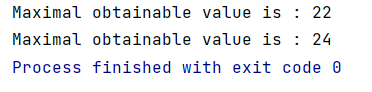
### Knapsack problems
#### Description
There is a knapsack with capacity C 
and there are N elements with weight Wi 
and price Pi. What is the biggest price 
that could be placed in a knapsack.
#### Fractional Knapsack
##### Description
It is allowed to put not a whole thing to the knapsack.
For example, 1/3 of the Nth element could be placed 
in the knapsack.
##### Solution idea
The greedy algorithm could be used in this case. 
It is easy to find the Price to Weight relation(R): Ri = Wi/Pi. 
Then we need to take elements with the highest R.
##### Solution
###### Analytical solution:
First dataset: Capacity = 50, Weights = {10, 20, 30}, Prices = {60, 100, 120};
1. Calculating the relations: 
Relations = {6, 5, 4};
2. Taking the object with the highest relation: 
Total price = 60, left capacity = 40, available objects = ({100, 20},{120, 30});
3. Taking the object with the highest relation: 
Total price = 160, left_capacity = 20, available objects = ({120, 30});
4. Taking the fraction from the object with the highest relation: 
fraction = left capacity / 30 = 2/3, total price = 160 + 2/3 * 120 = 240, left_capacity = 0;

ANSWER: 240

Second dataset: Capacity = 60, Weights = {5, 10, 15, 22, 25}, Prices = {30, 40, 45, 77, 90};
1. Calculating the relations:
Relations = {6, 4, 3, 3.5, 3.6};
2. Taking the object with the highest relation: 
Total price = 30, left capacity = 55, available objects = ({40, 10}, {45, 15}, {77, 22}, {90, 25});
3. Taking the object with the highest relation: 
Total price = 70, left capacity = 45, available objects = ({45, 15}, {77, 22}, {90, 25});
4. Taking the object with the highest relation: 
Total price = 160, left capacity = 20, available objects = ({45, 15}, {77, 22});
5. Taking the fraction from the object with the highest relation: 
fraction = left capacity / 22 = 20/22, total price = 160 + 20/22 * 77 = 160 + 70 = 230, left capacity = 0;

ANSWER = 230
###### C++ code:
See Cpp/Knapsack_fractional folder
```c++
//
// Created by glebg on 30.11.2021.
//
#include <iostream>
#include <vector>

double kn_fractional(double capacity, std::vector<double> weight, std::vector<double> price){
    // creating and filling the vector of pairs with index and double value of price/weight
    std::vector<std::pair<size_t, double>> relation{};
    for (size_t i = 0; i < weight.size(); ++i){
        relation.emplace_back(i, price[i]/weight[i]);
    }
    // sorting the vector by the relation value(second value)
    std::sort(relation.begin(), relation.end(), [](auto relation_a, auto relation_b){
        return relation_a.second < relation_b.second;
    }); 
    double c_copy{capacity};
    double max_price{0};
    // decreasing the capacity while it is not 0
    while (c_copy > 0){
        // if the weight of the element with the highest available relation of price to weight
        // is less than left capacity then
        if (c_copy - weight[relation.back().first] >= 0){
            // increasing the max price by the price of the element with the index that is stored in the pair
            max_price += price[relation.back().first];
            // decreasing the left capacity by the weight of the element with the index that is stored in the pair
            c_copy -= weight[relation.back().first];
            // deleting the element with the highest relation, because it has been already used
            relation.pop_back();
        } else {
        // increasing the max price by the price of the element with the index that is stored in the pair
        // multiplied by the relation of the left capacity to the weight of the element
        max_price += price[relation.back().first] * (c_copy / weight[relation.back().first]);
        c_copy = 0;
        }
    }
    // returning the maximum price of the knapsack
    return max_price;
}
    int main(){
    // dataset 1
    double capacity1{50};
    std::vector<double> weight1{10, 20, 30};
    std::vector<double> price1{60, 100, 120};
    // dataset 2
    double capacity2{60};
    std::vector<double> weight2{5, 10, 15, 22, 25};
    std::vector<double> price2{30, 40, 45, 77, 90};
    std::cout << "The biggest value that could be placed in the knapsack: " << kn_fractional(capacity1, weight1, price1) << "\n";
    std::cout << "The biggest value that could be placed in the knapsack: " << kn_fractional(capacity2, weight2, price2) << "\n";
    return 0;
}
```
###### Output:
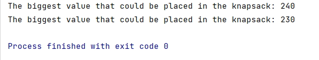
#### 0-1 Knapsack
##### Description
The difference, from Fractional Knapsack is that 
fraction of the element cannot be taken. Therefore, 
one element could be either taken or not.
##### Solution idea
There are a lot of different 
solution ideas for this problem, for example binary search 
or brute force, but the dynamic programming solution will be considered in this part.
The idea of the solution, that the whole problem of having the biggest price of 
all the elements that are available, could be split into 
sub-problems, what to choose - put the Ith element into the knapsack 
or not in order to have the highest price.
For realisation, vector of the length of C is used.
The program loops over the elements and inside the loop, 
it loops over the capacity, but the program goes from the C to 0. 
Then, in this loop, it takes the maximum value of vector[capacity] 
(price, if we don't put the element) and vector[capacity - Wi] + Pi 
(price, if we put in the knapsack the current element).
In the end, the program returns the last element of the vector, which is vector[capacity].
##### Solution
###### Analytical solution:
Capacity = 50; 
Weights = {10, 20, 30}, Prices = {60, 100, 120}.
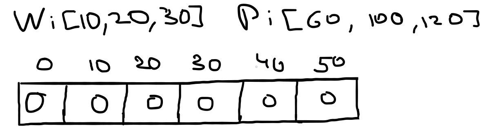
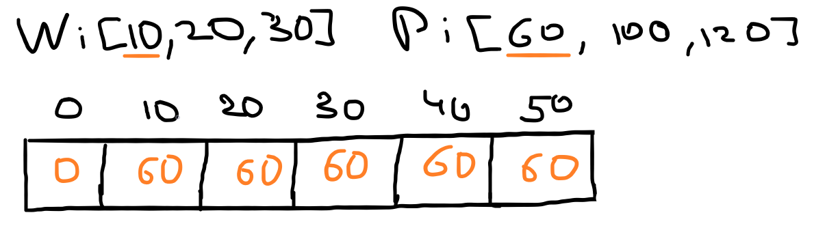
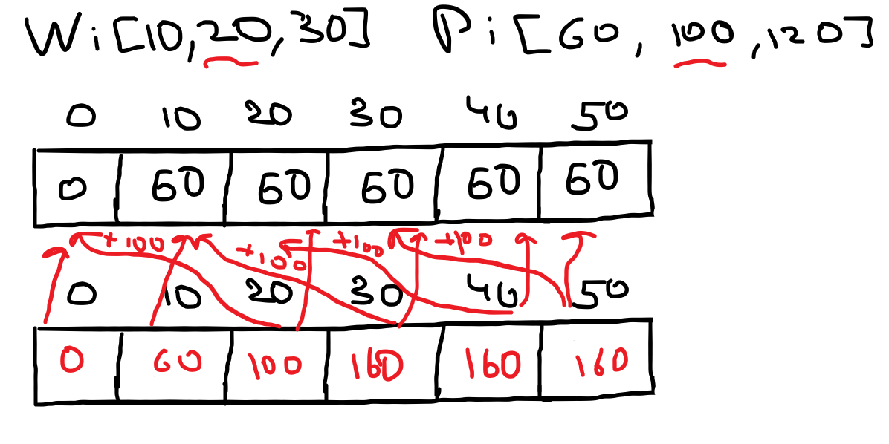
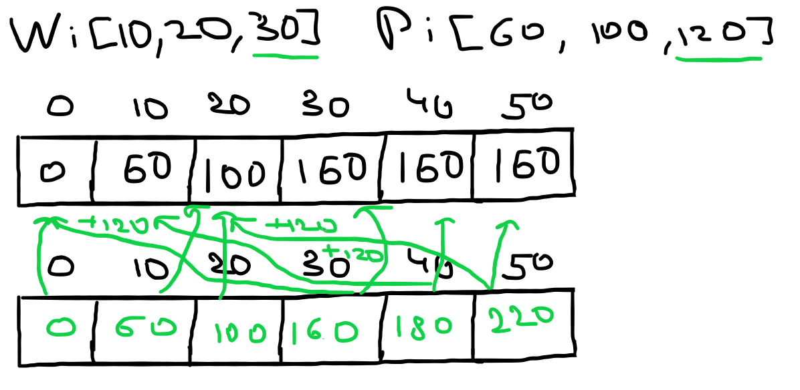
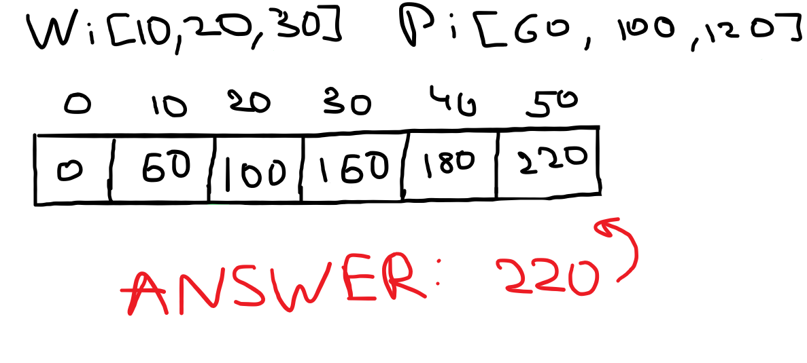
###### C++ code:
See Cpp/Knapsack_01 folder
```c++
//
// Created by glebg on 03.12.2021.
//
#include <iostream>
#include <vector>

int kn_01(std::vector<int>& weight, std::vector<int>& price, int capacity, int amount){
    // creating a vector for storing the maximum price of knapsack with capacity from 0 to capacity
    std::vector<int> result(capacity + 1, 0);
    // loop through all the elements that could be put into the knapsack
    for (int i = 0; i < amount; ++i){
        // loop through all the capacities, from the capacity of our main problem to 0
        for (int cap = capacity; cap >= 0; --cap){
            // if the weight of current element is less or equal to the length of current capacity, then
            if (weight[i] <= cap){
                // choosing the maximum value out of the current maximum and
                // the maximum current's element price + the maximum price of the knapsack with capacity, which equals
                // to the current capacity - weight of the current element
                result[cap] = std::max(result[cap],
                                result[cap - weight[i]] + price[i]);
            }
        }
    }
    // return the maximum price of the knapsack with the capacity that is requested by a function call
    return result[capacity];
}

int main(){
    // dataset 1
    std::vector<int> weights1 {10, 20, 30};
    std::vector<int> prices1 {60, 100, 120};
    int capacity1{50};
    std::cout << "Max price of the knapsack: " << kn_01(weights1, prices1, capacity1, static_cast<int>(weights1.size())) << "\n";

    // dataset 2
    std::vector<int> weights2 {95, 4, 60, 32, 23, 72, 80, 62, 65, 46};
    std::vector<int> prices2 {55, 10, 47, 5, 4, 50, 8, 61, 85, 87};
    int capacity2{269};
    std::cout << "Max price of the knapsack: " << kn_01(weights2, prices2, capacity2, static_cast<int>(weights2.size())) << "\n";

    // dataset 3
    std::vector<int> weights3 {92, 4, 43, 83, 84, 68, 92, 82, 6, 44, 32, 18, 56, 83, 25, 96, 70, 48, 14, 58};
    std::vector<int> prices3 {44, 46, 90, 72, 91, 40, 75, 35, 8, 54, 78, 40, 77, 15, 61, 17, 75, 29, 75, 63};
    int capacity3{878};
    std::cout << "Max price of the knapsack: " << kn_01(weights3, prices3, capacity3, static_cast<int>(weights3.size())) << "\n";
    return 0;
}
```
###### Output:
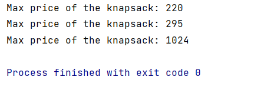